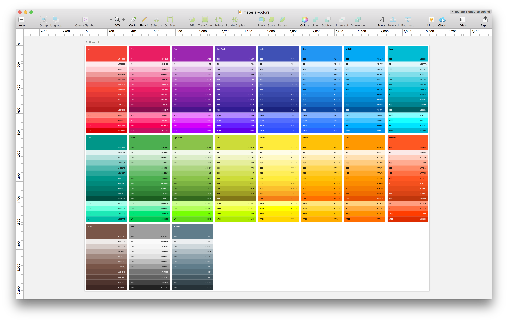

# Material Colors

## How to use
Download the example or [clone the repo](http://github.com/endswithak/material-colors):

Install the dependencies
```
npm install
```

Run with live reloading in Sketch, need a new sketch doc open
```
npm run render
```

Or, to install as a Sketch plugin:
```
npm run build
npm run link-plugin
```
Then, open Sketch and navigate to `Plugins → material-colors`
